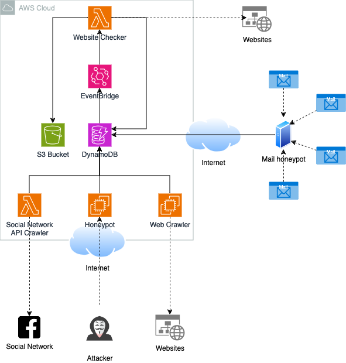

# Phishing URL Detection Project

## Project Description

This project aims to develop a complete solution for **collecting** and **analyzing** URLs to determine whether they are associated with **phishing** activities. The project is being developed collaboratively by a team of 5 members.

The core of the project is based on four main URL collection strategies, each playing a crucial role in gathering a wide range of potentially malicious links. Once collected, the URLs are stored in a **central database** before being analyzed to assess their threat level.

## URL Collection Strategies

We implement four primary components to collect URLs:

1. **Random Crawler**:
   - This component crawls **known phishing pages**, either discovered by our team or listed by external sources like **Google Safe Browsing**.
   - It randomly explores these pages to retrieve as many links as possible that could lead to malicious websites.

2. **Mail Server**:
   - A dedicated mail server is set up to **capture fraudulent emails**.
   - This server collects emails containing potentially dangerous links (e.g., phishing attempts), which are then extracted for further analysis.

3. **Honeypot**:
   - We have deployed a **honeypot**, an interactive trap simulating a vulnerable online service, to attract attackers and capture any malicious URLs they leave behind.
   - Suspicious interactions with this honeypot are logged and analyzed.

4. **Social Media**:
   - We use **social media APIs** (such as Facebook Graph, Twitter API) to retrieve links shared in posts, comments, or messages that may be associated with phishing attempts.
   - Extracted data is filtered using keywords and semantic analysis techniques to identify suspicious links.

## Centralized Database

All URLs collected by the four components are stored in a **centralized database**. Each URL is stored with associated metadata, such as:
- The **source of collection** (e.g., mail, honeypot, random crawler, social media)
- The **timestamp** of the collection
- Other relevant information to optimize future analysis.

## URL Analysis

A **final component** scans the database to analyze each URL. The goal is to determine if the URLs are indeed malicious.

The analysis is based on:
- **External malicious site databases** (e.g., Google Safe Browsing, PhishTank)
- Web page analysis techniques (content, structure, suspicious behaviors)

Non-malicious sites are also retained in the database, along with details of their source. This will allow us to evaluate the effectiveness of the various collection strategies and refine our methods.

## AWS Cloud Deployment

Our solution is deployed in the cloud via **AWS**. The infrastructure includes:
- The collection and analysis components distributed across various AWS services (EC2, S3, etc.)
- The centralized database hosted on secure cloud storage
- A detailed architecture diagram outlining this infrastructure is available in the repository.

## Solution Architecture Diagram



The diagram above illustrates the architecture of our solution, as well as the interactions between the different components. All data flows are managed through a scalable and secure infrastructure on AWS.

## File structure

```
phishing-browser/
├─ deploy/
├─ docs/
├─ src/
│  ├─ honeypot/
│  ├─ mail_honeypot/
│  ├─ shared/
│  |    ├─ models/
|  │    ├─ services/
│  ├─ social_network_crawler/
│  ├─ url_crawler/
├─ tests/
│  ├─ shared/
│  |    ├─ models/
|  │    ├─ services/
│  ├─ social_network_crawler/
│  ├─ url_crawler/
```

## Contributors

This project is developed by a team of five members:
- Florian Cunsolo
- Gabriel Pacotte
- Jordan Josserand
- Julian Gomez
- Yann Freddy Dongue Dongmo

## Getting Started

### Prerequisites

To run this project locally, you need to install:
- Python 3.9+
- Docker (for local testing and development environments)
- AWS CLI (for cloud deployment)

### Installation

Clone this repository to your local machine:

```bash
git clone https://gitlab.com/your-project.git
cd your-project
...
```